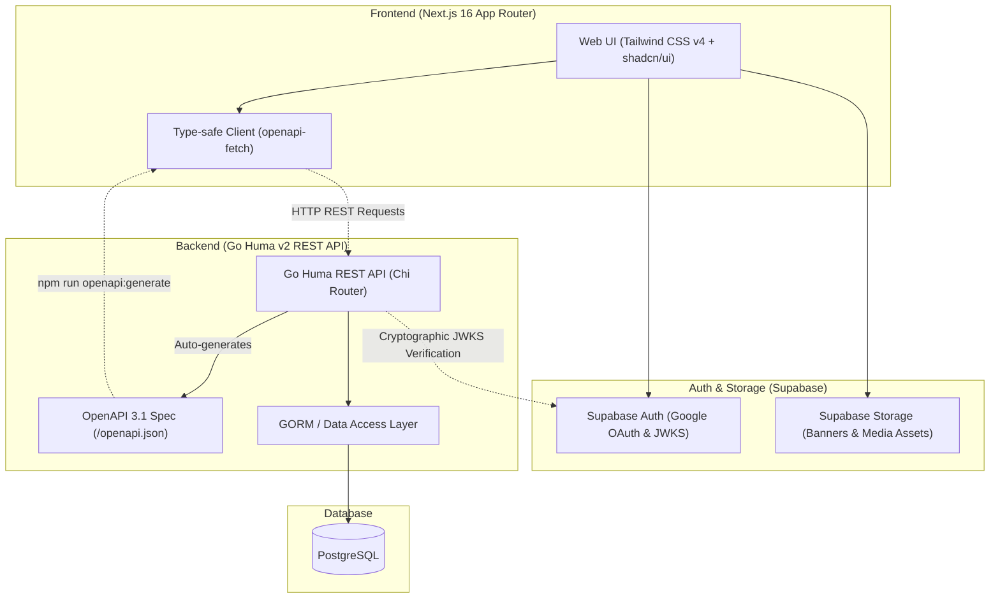
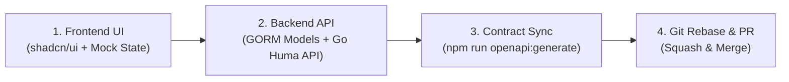

# Eventory

> **Eventory** is a full-stack platform for tournament management, competition hosting, and prize pool crowdfunding.

---

## System Architecture

Eventory connects a **Next.js 16 Frontend** and a **Go Huma v2 Backend** using a contract-first OpenAPI workflow:



---

## Technology Stack

| Layer | Technology | Description |
| :--- | :--- | :--- |
| **Frontend** | **Next.js 16 (App Router)** | React 19, TypeScript, Tailwind CSS v4, **shadcn/ui** (Base UI style), Lucide Icons |
| **Backend** | **Go 1.22+ & Huma v2** | High-performance Go REST API framework with automated OpenAPI 3.1 generation |
| **Router & ORM** | **Chi Router & GORM** | Lightweight HTTP routing, Chi middlewares, and PostgreSQL ORM with automatic schema migrations |
| **Database** | **PostgreSQL** | Relational database provisioned locally via Docker Compose |
| **Authentication** | **Supabase Auth** | Cookie-based SSR sessions, Google OAuth, and asymmetric JWKS verification |
| **File Storage** | **Supabase Storage** | Object storage for banners, organizer logos, and tournament assets |
| **API Contract** | **`openapi-fetch`** | 100% type-safe client generated directly from Go Huma OpenAPI 3.1 schema |

---

## Repository Structure

```text
eventory/
├── .env.example                  # Template for the single local environment file
├── Makefile                      # Root development commands
├── docker-compose.yml            # Complete local stack
├── docker-compose.production.yml # GHCR images used on Oracle
├── frontend/                     # Next.js 16 Frontend Application
│   ├── proxy.ts                  # Next.js 16 Proxy (JWT Verification & session refresh)
│   ├── app/                      # App Router routes and page layouts
│   ├── components/               # UI Primitives (shadcn/ui) & Layout components
│   ├── context/                  # App State & Role Context (Supabase session + Go API sync)
│   ├── lib/                      # openapi-fetch client, Supabase SSR helpers, utilities
│   └── .agents/skills/           # shadcn & supabase Best Practice Rules
│
├── backend/                      # Go Huma v2 API Service
│   ├── cmd/api/main.go           # Application entry point, Chi router, and Huma wiring
│   ├── internal/                 # Handlers, middlewares (JWKS), models, repositories, usecases
│   ├── pkg/                      # Database & configuration packages
│   └── Dockerfile                # Backend and migration binaries
│
└── .github/                      # Pull Request Template & GitHub Workflows
```

---

## Local Development Setup

### 1. Prerequisites
- **Node.js:** Version 24 or higher (`npm`)
- **Go:** Version 1.26 or higher
- **Docker & Docker Compose:** For running local PostgreSQL
- **Make:** For root development commands

---

### 2. Configure the local environment

```bash
cp .env.example .env
```

The ignored root `.env` is the only local configuration file used by the supported development commands.

### 3. Run the complete stack

```bash
make dev
# Equivalent to: docker compose up --build
```

- Frontend: `http://localhost:3000`
- Backend: `http://localhost:8080`
- API documentation: `http://localhost:8080/docs`

### 4. Run services separately

```bash
# Terminal 1: PostgreSQL
make db

# Run once after starting a new database
make migrate

# Terminal 2: Go backend on the host
make backend
# Or, with Air installed: make backend-dev

# Terminal 3: Next.js frontend on the host
make frontend
```

The Makefile loads root `.env`, constructs a host-compatible database connection for Go, and maps the neutral Supabase/API names to Next.js variables. In Compose, browser requests use `API_URL` while Next.js server actions reach the backend through Docker's internal `http://backend:8080` address.

### 5. CI/CD

Pull requests run tests, lint, and builds only. A merge to `main` builds ARM64 backend and frontend images, publishes commit-tagged images to GHCR, then deploys that exact commit to Oracle using `docker-compose.production.yml`. Production uses Supabase PostgreSQL and never starts the local PostgreSQL service.

Required GitHub Secrets:

- `PROD_SUPABASE_URL`
- `PROD_SUPABASE_PUBLISHABLE_KEY`
- `PROD_API_URL`
- `PROD_DB_DSN`
- `ORACLE_HOST`
- `ORACLE_USER`
- `ORACLE_SSH_KEY`
- `ORACLE_KNOWN_HOSTS`

> **Note on Frontend Dev Mode:**
> Frontend UI components can be developed and previewed immediately without backend or Supabase credentials. Simply use **"Dev Quick Login"** on the Navbar to simulate authenticated states.

---

## Recommended Full-Stack Development Flow (Example)

This is a suggested, pragmatic workflow example designed to keep frontend and backend development moving rapidly without blocking each other:



### Step 1: Frontend UI Development & Prototyping
- **UI Guidelines:** Build pages using shadcn/ui components (`components/ui/`). For both developers and AI assistants, refer to the **shadcn skill** in `frontend/.agents/skills/shadcn/` for component composition rules (Base UI `render` pattern, `flex` + `gap-*`, semantic color tokens).
- **Prototyping with Mock State:** Use mock data and mock states (e.g. `loginAsDev` in `RoleContext`) to construct and iterate on complete UI flows before backend endpoints are fully ready.

### Step 2: Backend API Development & Database Management
- **OpenAPI 3.1 with Huma:** Implement GORM models and use cases in `backend/internal/` and register routes using `huma.Register(...)` with Huma groups. Go Huma automatically generates OpenAPI 3.1 schemas and interactive documentation at `http://localhost:8080/docs` (and raw schema at `http://localhost:8080/openapi.json`).
- **Database & Model Alignment:** During early development, keep the database schema strictly aligned with Go struct models by utilizing GORM auto-migrations or resetting the database when models change:
  ```bash
  # From the repository root
  make reset    # Resets the DB schema
  make seed     # Populates consistent seed data for development
  ```
- Continuously update seed scripts so all team members can test with clean, realistic test records.

### Step 3: API Contract Sync & Integration
- Once backend endpoints are live, sync the OpenAPI schema to the frontend by running `npm run openapi:generate` in the `frontend` folder.
- This generates TypeScript types (`schema.d.ts`), giving the frontend end-to-end type safety (autocomplete for request bodies, path/query parameters, and response payloads) via `openapi-fetch` without manual type definitions.

### Step 4: Recommended Git Workflow & Pull Requests
- **Branch Naming (Suggestions):** Prefix branch names to give quick context, e.g. `feat/<feature-name>`, `fix/<bug-name>`, `chore/<task-name>`.
- **Rebase before Merging:** Keeping your feature branch rebased onto the latest `main` before merging keeps the Git commit graph linear and clean:
  1. `git fetch origin`
  2. `git rebase origin/main`
  3. *(If conflicts occur, resolve them and run `git rebase --continue`)*
  4. `git push origin <your-branch> --force-with-lease`
- **Pull Request Template:** A template is provided in `.github/PULL_REQUEST_TEMPLATE.md` as an optional example/guide you can follow to summarize changes and self-check code.
- **Squash and Merge:** We recommend using **Squash and Merge** when merging into `main` to combine work-in-progress commits into a single clean, readable commit on the main history graph.
