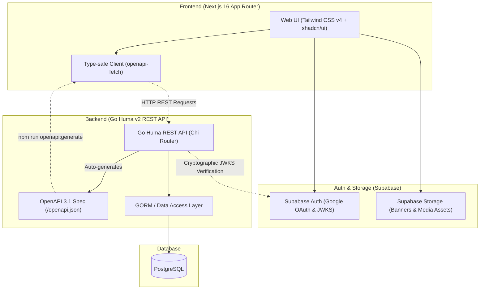
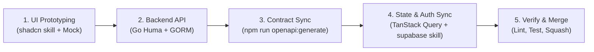

# Eventory

> **Eventory** is a full-stack platform for tournament management, competition hosting, and prize pool crowdfunding.

---

## System Architecture

Eventory connects a **Next.js 16 Frontend** and a **Go Huma v2 Backend** using a contract-first OpenAPI workflow:



---

## Technology Stack

| Layer | Technology | Description |
| :--- | :--- | :--- |
| **Frontend** | **Next.js 16 (App Router)** | React 19, TypeScript, Tailwind CSS v4, **shadcn/ui** (Base UI style), Lucide Icons |
| **Backend** | **Go 1.26+ & Huma v2** | High-performance Go REST API framework with automated OpenAPI 3.1 generation |
| **Router & ORM** | **Chi Router & GORM** | Lightweight HTTP routing, Chi middlewares, and PostgreSQL ORM with automatic schema migrations |
| **Database** | **PostgreSQL** | Relational database provisioned locally via Docker Compose |
| **Authentication** | **Supabase Auth** | Cookie-based SSR sessions, Google OAuth, and asymmetric JWKS verification |
| **File Storage** | **Supabase Storage** | Object storage for banners, organizer logos, and tournament assets |
| **API & State** | **`openapi-fetch` & TanStack Query** | 100% type-safe client and server-state caching synced with Go Huma OpenAPI 3.1 schema |

---

## Repository Structure

```text
eventory/
├── Makefile                      # Root development commands
├── docker-compose.yml            # Complete local stack
├── docker-compose.production.yml # GHCR images used on Oracle
├── frontend/                     # Next.js 16 Frontend Application
│   ├── .env.example              # Frontend environment template
│   ├── proxy.ts                  # Next.js 16 Proxy (JWT Verification & session refresh)
│   ├── app/                      # App Router routes, boundaries (error, not-found, loading), layouts
│   ├── components/               # UI Primitives (shadcn/ui Base UI) & Layout components
│   ├── context/                  # App State & Role Context (TanStack Query + Supabase sync)
│   ├── lib/                      # openapi-fetch client, Supabase SSR helpers, proxy-session
│   └── .agents/skills/           # shadcn & supabase Best Practice Rules
│
├── backend/                      # Go Huma v2 API Service
│   ├── .env.example              # Backend and local PostgreSQL template
│   ├── cmd/api/main.go           # Application entry point, Chi router, and Huma wiring
│   ├── internal/                 # Handlers, middlewares (JWKS), models, repositories, usecases
│   ├── pkg/                      # Database & configuration packages
│   └── Dockerfile                # Backend and migration binaries
│
└── .github/                      # Pull Request Template & GitHub Workflows
```

---

## Local Development Setup

### 1. Prerequisites

- **Docker Desktop / Docker Compose:** Runs local PostgreSQL or the optional complete containerized stack.
- **Node.js 24+** and **Go 1.26+:** Run the frontend and backend directly on the host for reliable hot reload.
- **GNU Make:** Optional on every platform. Native Windows users without Make can run the PowerShell script directly.

Docker, Node.js, Go, and Make are system tools and must already be installed.

---

### 2. Configure the local environment

Each application owns its local environment file:

```bash
cp backend/.env.example backend/.env
cp frontend/.env.example frontend/.env.local
```

On Windows PowerShell:

```powershell
Copy-Item backend/.env.example backend/.env
Copy-Item frontend/.env.example frontend/.env.local
```

`backend/.env` uses `localhost` because native Go connects through PostgreSQL's published port. Compose injects the same file but overrides `DB_DSN` with Docker's `postgres` hostname. Next.js loads `frontend/.env.local` automatically, and Compose also injects it into the frontend container.

### 3. Install local dependencies

```bash
make install
```

This runs `npm ci`, downloads the backend Go modules, and installs Air `v1.67.3`.

When adding a frontend package, install it on the host to update both the manifest and lockfile:

```bash
npm --prefix frontend install <package>
```

If you later use the complete Docker stack, synchronize its dependency volume with `make frontend-deps`.

When adding a backend module, update `go.mod` and `go.sum` from the host:

```bash
go -C backend get <module>
```

### 4. Run the development stack

The default workflow runs PostgreSQL in Docker and both applications on the host. It stops any existing Docker frontend/backend containers first so they cannot occupy the same ports, while leaving PostgreSQL running. This gives Next.js and Air direct access to the host filesystem for reliable hot reload.

With GNU Make on Linux, WSL, or Windows:

```bash
make dev
```

Make selects Bash or PowerShell from the operating system. Native Windows users without Make can run the script directly:

```powershell
.\scripts\dev.ps1
```

For the complete containerized stack instead:

```bash
make dev-docker
```

Without Make, the equivalent Docker command works in Bash and PowerShell:

```bash
docker compose --env-file backend/.env --env-file frontend/.env.local up --build
```

Restart the affected process after changing an environment file.

- Frontend: `http://localhost:3000`
- Backend: `http://localhost:8080`
- API documentation: `http://localhost:8080/docs`

Air rebuilds the native backend when Go files change. Next.js handles frontend Fast Refresh and CSS updates directly on the host.

### 5. Useful commands

```bash
# Start only PostgreSQL
make db

# Start both applications natively
make dev

# Start the complete stack in Docker
make dev-docker

# Run migrations or seed data natively
make migrate
make seed

# Run migrations or seed data through a freshly built Docker image
make migrate-docker
make seed-docker

# Start one application natively
make backend
make frontend

# Start one application through Docker
make backend-docker
make frontend-docker

# Refresh Docker dependencies after changing frontend packages
make frontend-deps

# Stop the stack
make down
```

No development script parses or exports `.env` values. Viper reads `backend/.env` for native commands, Next.js reads `frontend/.env.local`, and Compose injects both files for containers. Browser-visible frontend settings use the `NEXT_PUBLIC_` prefix. In Docker, server-side frontend requests use the private `http://backend:8080` address while browser requests continue using `NEXT_PUBLIC_API_URL`.

### 6. CI/CD

Pull requests run tests, lint, and builds only. A merge to `main` builds ARM64 backend and frontend images, publishes commit-tagged images to GHCR, then deploys that exact commit to Oracle using `docker-compose.production.yml`. Production uses Supabase PostgreSQL and never starts the local PostgreSQL service.

Required GitHub Secrets:

- `PROD_SUPABASE_URL`
- `PROD_SUPABASE_PUBLISHABLE_KEY`
- `PROD_API_URL`
- `PROD_DB_DSN`
- `ORACLE_HOST`
- `ORACLE_USER`
- `ORACLE_SSH_KEY`
- `ORACLE_KNOWN_HOSTS`

> **Note on Frontend Dev Mode:**
> Frontend UI components can be developed and previewed immediately without backend or Supabase credentials. Simply use **"Dev Quick Login"** on the Navbar to simulate authenticated states.

---

## Recommended Full-Stack Development Flow

This workflow is designed to keep frontend and backend development moving rapidly with contract-first type safety, design system consistency, and cryptographic security:



### Step 1: Frontend UI Prototyping (shadcn skill + Mock State)
- Build pages using Base UI primitives in `components/ui/`. Refer directly to `frontend/.agents/skills/shadcn/` and `frontend/AGENTS.md` for Base UI composition (`render` prop, `data-icon` button rules, `<FieldGroup>` forms, and semantic styling tokens).
- Use mock state (`loginAsDev` in `context/role-context.tsx`) to rapidly prototype interactive role-switching flows without waiting for backend or auth services.

### Step 2: Backend API Development (Go Huma v2 & GORM)
- Implement repository interfaces, GORM models, and use cases in `backend/internal/`.
- Register endpoints via `huma.Register(...)` with named request/response structs, producing standard HTTP statuses (e.g. `201 Created` for resource creation, RFC 9457 `409 Conflict` for collisions).
- Validate with unit tests: `go test -v ./...` in `backend`.

### Step 3: API Contract Sync & TanStack Query Integration
- Once backend endpoints are live, run in `frontend/`:
  ```bash
  npm run openapi:generate
  ```
- This updates `frontend/lib/api/schema.d.ts` with end-to-end type safety.
- Connect the frontend to backend endpoints using the `$api` openapi-react-query client:
  ```tsx
  import { $api } from "@/lib/api/client";

  const { data, isLoading } = $api.useQuery("get", "/api/v1/tournaments");
  ```
- Invalidate and refetch cached queries when mutations or server actions succeed using `queryClient.invalidateQueries(...)`.

### Step 4: Verification & Git Workflow
- **Frontend Quality Gate:**
  ```bash
  cd frontend
  npm run lint       # ESLint check
  npx tsc --noEmit   # Strict TypeScript typecheck
  npm run format     # Optional: Prettier format for cleanliness (not required if diff is clean)
  ```
- **Backend Quality Gate:**
  ```bash
  cd backend
  go test -v ./...   # Unit tests
  go build ./cmd/api # Binary compilation check
  ```
- **Rebase & PR:**
  - Prefix commit messages using Conventional Commits (`feat:`, `fix:`, `refactor:`, `chore:`).
  - Rebase onto the latest `origin/main` before opening or updating pull requests.
  - Merge into `main` using **Squash and Merge** to maintain a linear Git history graph.
