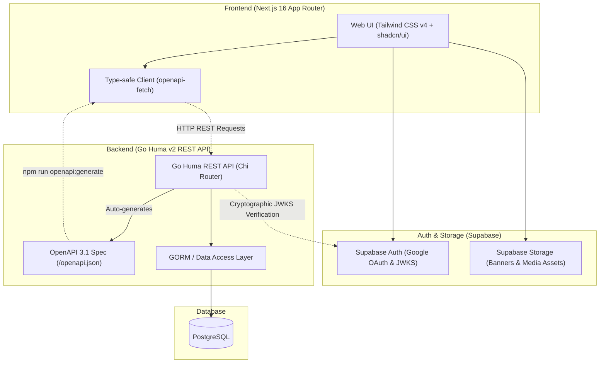
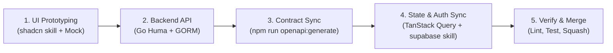

# Eventory

> **Eventory** is a full-stack platform for tournament management, competition hosting, and prize pool crowdfunding.

---

## System Architecture

Eventory connects a **Next.js 16 Frontend** and a **Go Huma v2 Backend** using a contract-first OpenAPI workflow:



---

## Technology Stack

| Layer | Technology | Description |
| :--- | :--- | :--- |
| **Frontend** | **Next.js 16 (App Router)** | React 19, TypeScript, Tailwind CSS v4, **shadcn/ui** (Base UI style), Lucide Icons |
| **Backend** | **Go 1.22+ & Huma v2** | High-performance Go REST API framework with automated OpenAPI 3.1 generation |
| **Router & ORM** | **Chi Router & GORM** | Lightweight HTTP routing, Chi middlewares, and PostgreSQL ORM with automatic schema migrations |
| **Database** | **PostgreSQL** | Relational database provisioned locally via Docker Compose |
| **Authentication** | **Supabase Auth** | Cookie-based SSR sessions, Google OAuth, and asymmetric JWKS verification |
| **File Storage** | **Supabase Storage** | Object storage for banners, organizer logos, and tournament assets |
| **API & State** | **`openapi-fetch` & TanStack Query** | 100% type-safe client and server-state caching synced with Go Huma OpenAPI 3.1 schema |

---

## Repository Structure

```text
eventory/
├── .env.example                  # Template for the single local environment file
├── Makefile                      # Root development commands
├── docker-compose.yml            # Complete local stack
├── docker-compose.production.yml # GHCR images used on Oracle
├── frontend/                     # Next.js 16 Frontend Application
│   ├── proxy.ts                  # Next.js 16 Proxy (JWT Verification & session refresh)
│   ├── app/                      # App Router routes, boundaries (error, not-found, loading), layouts
│   ├── components/               # UI Primitives (shadcn/ui Base UI) & Layout components
│   ├── context/                  # App State & Role Context (TanStack Query + Supabase sync)
│   ├── lib/                      # openapi-fetch client, Supabase SSR helpers, proxy-session
│   └── .agents/skills/           # shadcn & supabase Best Practice Rules
│
├── backend/                      # Go Huma v2 API Service
│   ├── cmd/api/main.go           # Application entry point, Chi router, and Huma wiring
│   ├── internal/                 # Handlers, middlewares (JWKS), models, repositories, usecases
│   ├── pkg/                      # Database & configuration packages
│   └── Dockerfile                # Backend and migration binaries
│
└── .github/                      # Pull Request Template & GitHub Workflows
```

---

## Local Development Setup

### 1. Prerequisites
- **Docker Desktop / Docker Compose:** Runs the complete local stack on Windows, macOS, and Linux.
- **GNU Make** is optional; it only provides short aliases for Docker Compose.
- **Node.js 24+** and **Go 1.26+** are needed only for host-side IDE tooling, linting, and tests.

---

### 2. Configure the local environment

```bash
cp .env.example .env
```

On Windows PowerShell:

```powershell
Copy-Item .env.example .env
```

The ignored root `.env` is the only local configuration file. Its `DB_DSN` points to the local Compose service named `postgres`; production supplies a Supabase `DB_DSN` instead.

### 3. Run the complete stack

```bash
docker compose up --build
```

`make dev` runs the same command if GNU Make is installed.

Frontend and backend source changes reload automatically. Restart Compose after changing `.env`.

- Frontend: `http://localhost:3000`
- Backend: `http://localhost:8080`
- API documentation: `http://localhost:8080/docs`

### 4. Local dependencies and IDE support

> [!TIP]
> Docker runs the application without host-installed dependencies. However, installing them locally is recommended when VS Code, Cursor, or another IDE runs on the host or in WSL, so IntelliSense, autocomplete, linting, and Go tooling can resolve the project correctly.

Initial setup for editor support:

```bash
# Frontend TypeScript and ESLint dependencies
npm --prefix frontend ci

# Backend modules for gopls and other Go tools
go -C backend mod download
```

When adding a frontend package, install it on the host to update `package.json`, `package-lock.json`, and the host `node_modules`. Then run `make frontend-deps` while the local stack is running. It safely stops the frontend, synchronizes Docker's dependency volume, and starts the frontend again:

```bash
npm --prefix frontend install <package>
make frontend-deps
```

When adding a backend module, update `go.mod` and `go.sum` from the host:

```bash
go -C backend get <module>
```

The backend source is mounted into Docker immediately. When the related Go source is saved, Air rebuilds and restarts the API.

### 5. Useful commands

```bash
# Start only PostgreSQL
make db

# Run migrations or seed data in containers
make migrate
make seed

# Start a service and its required dependencies
make backend
make frontend

# Refresh Docker dependencies after changing frontend packages
make frontend-deps

# Stop the stack
make down
```

The Makefile does not parse or transform `.env`; every runtime command delegates to Docker Compose. The backend reads `DB_DSN` directly. Next.js exposes the explicitly public `SUPABASE_URL`, `SUPABASE_PUBLISHABLE_KEY`, and `API_URL` values through `next.config.ts`. Server actions use Docker's internal `http://backend:8080` address.

### 6. CI/CD

Pull requests run tests, lint, and builds only. A merge to `main` builds ARM64 backend and frontend images, publishes commit-tagged images to GHCR, then deploys that exact commit to Oracle using `docker-compose.production.yml`. Production uses Supabase PostgreSQL and never starts the local PostgreSQL service.

Required GitHub Secrets:

- `PROD_SUPABASE_URL`
- `PROD_SUPABASE_PUBLISHABLE_KEY`
- `PROD_API_URL`
- `PROD_DB_DSN`
- `ORACLE_HOST`
- `ORACLE_USER`
- `ORACLE_SSH_KEY`
- `ORACLE_KNOWN_HOSTS`

> **Note on Frontend Dev Mode:**
> Frontend UI components can be developed and previewed immediately without backend or Supabase credentials. Simply use **"Dev Quick Login"** on the Navbar to simulate authenticated states.

---

## Recommended Full-Stack Development Flow

This workflow is designed to keep frontend and backend development moving rapidly with contract-first type safety, design system consistency, and cryptographic security:



### Step 1: Frontend UI Prototyping (shadcn skill + Mock State)
- Build pages using Base UI primitives in `components/ui/`. Refer directly to `frontend/.agents/skills/shadcn/` and `frontend/AGENTS.md` for Base UI composition (`render` prop, `data-icon` button rules, `<FieldGroup>` forms, and semantic styling tokens).
- Use mock state (`loginAsDev` in `context/role-context.tsx`) to rapidly prototype interactive role-switching flows without waiting for backend or auth services.

### Step 2: Backend API Development (Go Huma v2 & GORM)
- Implement repository interfaces, GORM models, and use cases in `backend/internal/`.
- Register endpoints via `huma.Register(...)` with named request/response structs, producing standard HTTP statuses (e.g. `201 Created` for resource creation, RFC 9457 `409 Conflict` for collisions).
- Validate with unit tests: `go test -v ./...` in `backend`.

### Step 3: API Contract Sync & TanStack Query Integration
- Once backend endpoints are live, run in `frontend/`:
  ```bash
  npm run openapi:generate
  ```
- This updates `frontend/lib/api/schema.d.ts` with end-to-end type safety.
- Connect the frontend to backend endpoints using the `$api` openapi-react-query client:
  ```tsx
  import { $api } from "@/lib/api/client";

  const { data, isLoading } = $api.useQuery("get", "/api/v1/tournaments");
  ```
- Invalidate and refetch cached queries when mutations or server actions succeed using `queryClient.invalidateQueries(...)`.

### Step 4: Verification & Git Workflow
- **Frontend Quality Gate:**
  ```bash
  cd frontend
  npm run lint       # ESLint check
  npx tsc --noEmit   # Strict TypeScript typecheck
  npm run format     # Optional: Prettier format for cleanliness (not required if diff is clean)
  ```
- **Backend Quality Gate:**
  ```bash
  cd backend
  go test -v ./...   # Unit tests
  go build ./cmd/api # Binary compilation check
  ```
- **Rebase & PR:**
  - Prefix commit messages using Conventional Commits (`feat:`, `fix:`, `refactor:`, `chore:`).
  - Rebase onto the latest `origin/main` before opening or updating pull requests.
  - Merge into `main` using **Squash and Merge** to maintain a linear Git history graph.
