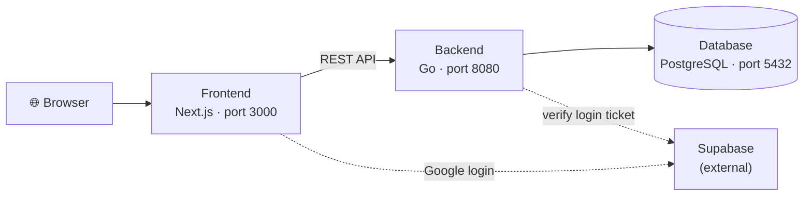

# Eventory

A platform for hosting tournaments, with crowdfunding from sponsors.

One account, three modes: **Competitor** (join events), **Organizer** (host events), **Sponsor** (fund events).

---

## The four moving parts



| Part | What it does | Folder |
| --- | --- | --- |
| **Frontend** | The pages you see and click | `frontend/` |
| **Backend** | Rules, permissions, data access | `backend/` |
| **Database** | Stores accounts, tournaments, teams | runs in Docker |
| **Supabase** | "Sign in with Google" + image uploads | external service |

New to these words? See the **[Glossary](docs/glossary.md)**.

---

## Quick start

You need **Docker**, **Go 1.26+**, and **Node.js 24+** installed.

```bash
# 1. Settings files (once)
cp backend/.env.example backend/.env
cp frontend/.env.example frontend/.env.local

# 2. Install packages (once, and after any teammate adds a package)
make install

# 3. Start the database, build its tables, add sample data (once)
make db
make reset && make seed

# 4. Run it
make dev
```

Then open:

| URL | What |
| --- | --- |
| http://localhost:3000 | The website |
| http://localhost:8080/docs | Backend endpoint list |

No `make` on your machine? Every command has a plain equivalent in **[Getting Started](docs/getting-started.md)**.

---

## Documentation

| Doc | Read it when |
| --- | --- |
| **[Getting Started](docs/getting-started.md)** | Setting up, or choosing how to run the project |
| **[Troubleshooting](docs/troubleshooting.md)** | Something broke |
| **[Glossary](docs/glossary.md)** | A word in the code or docs makes no sense |
| **[Frontend](frontend/README.md)** | Working on pages and UI |
| **[Backend](backend/README.md)** | Working on the API and database |
| **[Deployment](docs/deployment.md)** | Wondering how code reaches the live server |

---

## Tech stack

| Layer | Tools |
| --- | --- |
| Frontend | Next.js 16, React 19, TypeScript, Tailwind CSS v4, shadcn/ui |
| Backend | Go 1.26, Huma v2, Chi router, GORM |
| Database | PostgreSQL 18 |
| Auth & files | Supabase |
| Frontend ↔ backend | OpenAPI types + TanStack Query |

---

## Contributing

| Rule | Detail |
| --- | --- |
| Commit style | `feat:` `fix:` `refactor:` `chore:` |
| Before a PR | `make test`, then rebase onto latest `main` |
| Merging | Squash and merge |
| Changed a backend endpoint? | From the repo root: `npm --prefix frontend run openapi:generate` |
