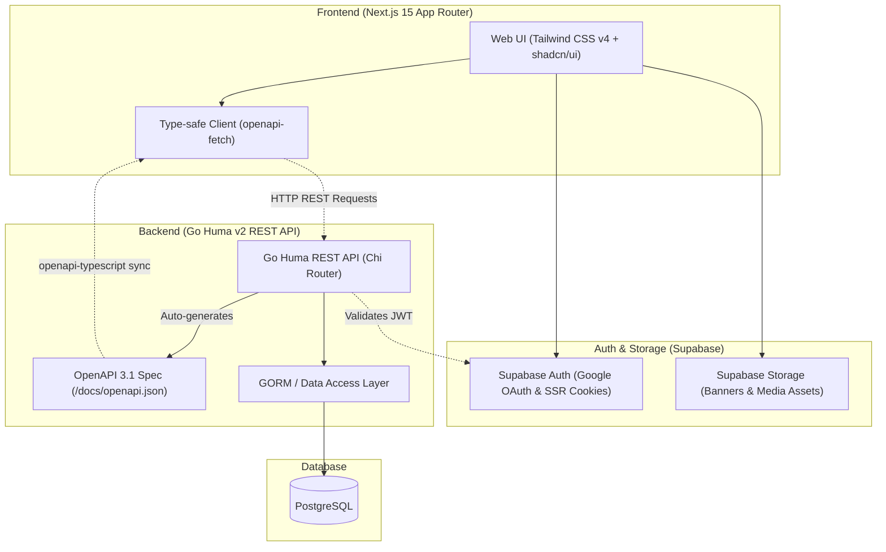
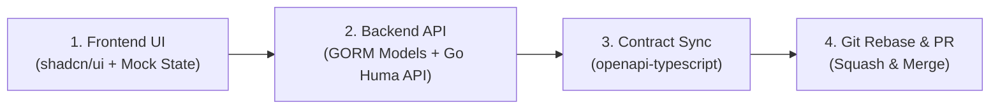

# Eventory

> **Eventory** is a full-stack platform for tournament management, competition hosting, and prize pool crowdfunding.

---

## System Architecture

Eventory connects a **Next.js 15 Frontend** and a **Go Huma v2 Backend** using a contract-first OpenAPI workflow:



---

## Technology Stack

| Layer | Technology | Description |
| :--- | :--- | :--- |
| **Frontend** | **Next.js 15+ (App Router)** | React 19, TypeScript, Tailwind CSS v4, **shadcn/ui** (Base UI style), Lucide Icons |
| **Backend** | **Go 1.22+ & Huma v2** | High-performance Go REST API framework with automated OpenAPI 3.1 generation |
| **Router & ORM** | **Chi Router & GORM** | Lightweight HTTP routing and PostgreSQL ORM with automatic schema migrations |
| **Database** | **PostgreSQL** | Relational database provisioned locally via Docker Compose |
| **Authentication** | **Supabase Auth** | Cookie-based SSR sessions with Google OAuth integration |
| **File Storage** | **Supabase Storage** | Object storage for banners, organizer logos, and tournament assets |
| **API Contract** | **`openapi-fetch`** | 100% type-safe client generated directly from Go Huma OpenAPI 3.1 schema |

---

## Repository Structure

```text
eventory/
├── frontend/                     # Next.js 15 Frontend Application
│   ├── app/                      # App Router routes and page layouts
│   ├── components/               # UI Primitives (shadcn/ui) & Layout components
│   ├── context/                  # App State & Role Context (with Dev Quick Login)
│   ├── lib/                      # Supabase SSR clients and utility helpers
│   └── .agents/skills/shadcn/    # shadcn/ui Guidelines & Best Practice Rules
│
├── backend/                      # Go Huma v2 API Service
│   ├── cmd/api/main.go           # Application entry point & Huma router wiring
│   ├── internal/                 # Handlers, middlewares, models, repositories, usecases
│   ├── pkg/                      # Database & configuration packages
│   ├── docker-compose.yml        # Local PostgreSQL container provisioning
│   └── Makefile                  # Automation commands (dev, migrate, reset, seed)
│
└── .github/                      # Pull Request Template & GitHub Workflows
```

---

## Local Development Setup

### 1. Prerequisites
- **Node.js:** Version 20 or higher (`npm`)
- **Go:** Version 1.22 or higher
- **Docker & Docker Compose:** For running local PostgreSQL

---

### 2. Backend Setup
```bash
cd backend

# 1. Start local PostgreSQL
docker-compose up -d

# 2. Run backend API server
go run cmd/api/main.go
# Or using Air for live reload: make dev
```
- API server runs at: `http://localhost:8080`
- Interactive OpenAPI 3.1 documentation URL: `http://localhost:8080/docs`

---

### 3. Frontend Setup
```bash
cd frontend

# 1. Install dependencies
npm install

# 2. Start Next.js development server
npm run dev
```
- Frontend application runs at: `http://localhost:3000`

> **Note on Frontend Dev Mode:**
> Frontend UI components can be developed and previewed immediately without backend or Supabase credentials. Simply use **"Dev Quick Login"** on the Navbar to simulate authenticated states.

---

## Recommended Full-Stack Development Flow (Example)

This is a suggested, pragmatic workflow example designed to keep frontend and backend development moving rapidly without blocking each other:



### Step 1: Frontend UI Development & Prototyping
- **UI Guidelines:** Build pages using shadcn/ui components (`components/ui/`). For both developers and AI assistants, refer to the **shadcn skill** in `frontend/.agents/skills/shadcn/` for component composition rules (Base UI `render` pattern, `flex` + `gap-*`, semantic color tokens).
- **Prototyping with Mock State:** Use mock data and mock states (e.g. `loginAsDev` in `RoleContext`) to construct and iterate on complete UI flows before backend endpoints are fully ready.

### Step 2: Backend API Development & Database Management
- **OpenAPI 3.1 with Huma:** Implement GORM models and use cases in `backend/internal/` and register routes using `huma.Register(...)`. Go Huma automatically generates OpenAPI 3.1 schemas and interactive documentation at the URL `http://localhost:8080/docs` (and the raw JSON schema at `http://localhost:8080/docs/openapi.json`).
- **Database & Model Alignment:** During early development, keep the database schema strictly aligned with Go struct models by utilizing GORM auto-migrations or resetting the database when models change:
  ```bash
  # In backend directory
  make reset    # Resets the DB schema
  make seed     # Populates consistent seed data for development
  ```
- Continuously update seed scripts so all team members can test with clean, realistic test records.

### Step 3: API Contract Sync & Integration
- Once backend endpoints are live, sync the OpenAPI schema to the frontend by running `openapi-typescript` against `http://localhost:8080/docs/openapi.json`.
- This generates TypeScript types (`schema.d.ts`), giving the frontend end-to-end type safety (autocomplete for request bodies, path/query parameters, and response payloads) via `openapi-fetch` without manual type definitions.

### Step 4: Recommended Git Workflow & Pull Requests
- **Branch Naming (Suggestions):** Prefix branch names to give quick context, e.g. `feat/<feature-name>`, `fix/<bug-name>`, `chore/<task-name>`.
- **Rebase before Merging:** Keeping your feature branch rebased onto the latest `main` before merging keeps the Git commit graph linear and clean:
  1. `git fetch origin`
  2. `git rebase origin/main`
  3. *(If conflicts occur, resolve them and run `git rebase --continue`)*
  4. `git push origin <your-branch> --force-with-lease`
- **Pull Request Template:** A template is provided in `.github/PULL_REQUEST_TEMPLATE.md` as an optional example/guide you can follow to summarize changes and self-check code.
- **Squash and Merge:** We recommend using **Squash and Merge** when merging into `main` to combine work-in-progress commits into a single clean, readable commit on the main history graph.
