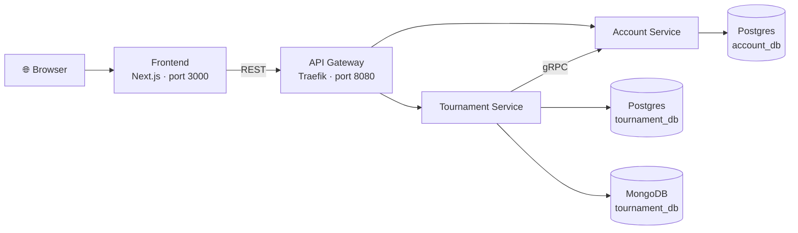

# Eventory

A platform for hosting tournaments, with crowdfunding from sponsors.

One account, three modes: **Competitor** (join events), **Organizer** (host events), **Sponsor** (fund events).

---

## Architecture (local)


```mermaid
flowchart LR
    Browser["🌐 Browser"] --> FE["Frontend<br/>Next.js · port 3000"]
    FE -->|REST| GW["API Gateway<br/>Traefik · port 8080"]
    GW --> ACC["Account Service"]
    GW --> TOUR["Tournament Service"]
    ACC --> PG[("Postgres<br/>account_db")]
    TOUR --> PG2[("Postgres<br/>tournament_db")]
    TOUR --> MONGO[("MongoDB<br/>tournament_db")]
    TOUR -->|gRPC| ACC
```

| Part | What it does | Where |
| --- | --- | --- |
| **Frontend** | The pages you see and click | `frontend/` |
| **Account / Tournament** | Backend services | `backend/services/*`, Compose profile `apps` |
| **Traefik, Postgres & MongoDB** | API Gateway and databases | Compose profile `infra` |
| **Supabase** | Google login and uploads | external |

---

## Quick start

You need **[Docker](https://www.docker.com)**, **[Go 1.26+](https://go.dev/doc/install)**, **[Node.js 24+](https://nodejs.org/en/download)**, and **[Task](https://taskfile.dev/installation)**.

```bash
# 1. Frontend settings (once)
cp frontend/.env.example frontend/.env.local

# 2. Start Postgres, Traefik, Account, and Tournament, then Next.js on the host
task dev
```

Backend defaults live in `backend/services/<name>/.env.default`. A local `.env` next to it is only for overrides.

Then open:

| URL | What |
| --- | --- |
| http://localhost:3000 | The website |
| http://localhost:8080/health | Gateway health check |
| http://localhost:8081/docs | Account OpenAPI |
| http://localhost:8082/docs | Tournament OpenAPI |

Useful tasks:

```bash
task migrate   # account_db, then tournament_db
task seed      # sample data, after the apps are up
task logs      # infra and app logs
task down      # stop Compose
task web       # also run the frontend in Docker
task db:reset  # stop the stack and delete the local Postgres volume
task test      # backend tests, frontend lint, frontend typecheck
```

`task dev` leaves the containers running after you stop Next.js with Ctrl+C. `task down` stops them.

An existing Postgres volume from the old single-database setup does not contain `account_db` and `tournament_db`. Run `task db:reset` once (delete local data), then `task dev` or `task apps` if you need the stack again.

---

## Documentation

| Doc | Read it when |
| --- | --- |
| **[Getting Started](docs/getting-started.md)** | Setup details |
| **[Troubleshooting](docs/troubleshooting.md)** | Something broke |
| **[Glossary](docs/glossary.md)** | A word in the code or docs makes no sense |
| **[Frontend](frontend/README.md)** | Working on pages and UI |
| **[Backend](backend/README.md)** | Working on the API and database |
| **[Deployment](docs/deployment.md)** | How code reaches the live server |

---

## Tech stack

| Layer | Tools |
| --- | --- |
| Frontend | Next.js 16, React 19, TypeScript, Tailwind CSS v4, shadcn/ui |
| Backend | Go 1.26, Huma v2, Chi router, GORM, gRPC |
| Database | PostgreSQL 18 |
| Auth & files | Supabase |
| Frontend ↔ backend | OpenAPI types + TanStack Query |

---

## Contributing

| Rule | Detail |
| --- | --- |
| Commit style | `feat:` `fix:` `refactor:` `chore:` |
| Before a PR | `task test`, then rebase onto latest `main` |
| Merging | Squash and merge |
| Changed a backend endpoint? | After `task apps`: `npm --prefix frontend run openapi:generate` |
