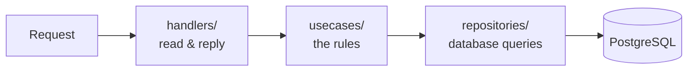
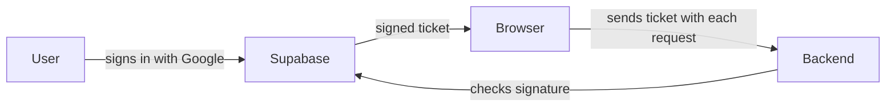

# Backend

The hidden server behind Eventory. It checks the rules and owns the database. Written in Go.

Setup and run instructions live in **[Getting Started](../docs/getting-started.md)**. This page is about the code.

---

## Run it

```bash
# 1. Database (Docker)
docker compose -f ../docker-compose.yml --env-file .env up -d --wait postgres

# 2. Tables and sample data (first time)
go run ./cmd/migrate -reset
go run ./cmd/seed

# 3. Server, restarts when you save
air -c .air.toml
```

| URL | What |
| --- | --- |
| http://localhost:8080/docs | Clickable list of every endpoint. Start here. |
| http://localhost:8080/health | Should answer with an empty "204" response |

---

## Where things go

A request travels through four layers. Each one has a single job.



| Folder | Job | Example question it answers |
| --- | --- | --- |
| `handlers/` | Read the request, send the reply | "What did the browser send?" |
| `usecases/` | The actual rules | "Is this user allowed to close registration?" |
| `repositories/` | Database reads and writes | "Fetch tournament 123" |
| `models/` | Shape of each table | "What columns does a tournament have?" |
| `middlewares/` | Runs before handlers | "Is this person logged in?" |
| `cmd/` | Three programs: `api`, `migrate`, `seed` | — |
| `pkg/` | Settings and database connection | — |

**Why split it up:** the rules in `usecases/` stay readable and testable because they contain no web code and no database code.

---

## Adding an endpoint

1. Add or update a table shape in `models/`.
2. Add the query in `repositories/`.
3. Put the rules in `usecases/`, and write a test next to it.
4. Register the endpoint in `handlers/` with `huma.Register(...)`.
5. Check it appears at http://localhost:8080/docs.
6. Tell the frontend about it:

```bash
npm --prefix ../frontend run openapi:generate
```

Step 6 is required. The frontend gets its types from the running backend, so skipping it leaves the frontend blind to your new endpoint.

---

## Commands

| Command | Does |
| --- | --- |
| `air -c .air.toml` | Run the server, restart on save |
| `go run ./cmd/api` | Run the server, no auto-restart |
| `go run ./cmd/migrate` | Add new tables, keep existing data |
| `go run ./cmd/migrate -reset` | ⚠️ Delete everything, rebuild tables |
| `go run ./cmd/seed` | Add sample accounts and tournaments |
| `go test ./...` | Run the tests |
| `go build ./cmd/api` | Check it still compiles |

Run `go test ./...` before opening a pull request.

---

## Settings

All settings come from `backend/.env`. Copy it from the template the first time:

```bash
cp .env.example .env
```

| Setting | Meaning |
| --- | --- |
| `PORT` | Which port the server listens on (8080) |
| `DB_DSN` | Full address of the database, including user and password |
| `POSTGRES_*` | User, password, database name and port for the Docker container |
| `SUPABASE_URL` | Used to verify login tickets |
| `CORS_ALLOWED_ORIGINS` | Which websites may call this API |

> Already have PostgreSQL on your machine? Port 5432 is taken. Change `POSTGRES_PORT` **and** the port inside `DB_DSN` to 5433.

---

## Login, briefly



The backend never sees a password. It only checks that the ticket's signature is genuine.

---

Something broken? → **[Troubleshooting](../docs/troubleshooting.md)**
