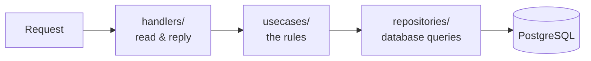
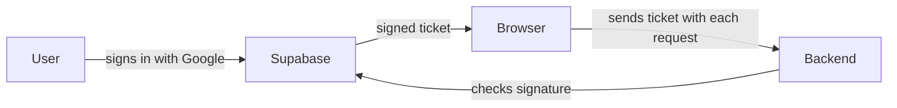

# Backend

The hidden server behind Eventory. It checks the rules and owns the database. Written in Go.

Setup and run instructions live in **[Getting Started](../docs/getting-started.md)**. This page is about the code.

---

## Run it

From the repo root, pick one:

```bash
# Postgres, Traefik, Account, Tournament, frontend on the host
task dev

# or the same stack without the frontend
task apps
```

Both run `task migrate` first: Account schema, then Tournament. `task migrate` alone starts Postgres and applies those schemas. It does not start the APIs.

```bash
# sample rows, after the apps are healthy
task seed
```

To run a service on the host instead of in Compose, use `task migrate`, then:

```bash
go run ./services/account/cmd/api
go run ./services/tournament/cmd/api
```

`8081`, `9091`, and `8082` must be free, so do not leave `task apps` running. Traefik on `:8080` forwards to the containers, not to these host processes. Call `:8081` and `:8082` directly.

| URL | What |
| --- | --- |
| http://localhost:8081/docs | Account endpoints |
| http://localhost:8082/docs | Tournament endpoints |
| http://localhost:8080/health | Gateway health check |

---

## Where things go

A request travels through four layers. Each one has a single job.


```mermaid
flowchart LR
    R["Request"] --> H["handlers/<br/>read & reply"]
    H --> U["usecases/<br/>the rules"]
    U --> Rep["repositories/<br/>database queries"]
    Rep --> DB[("PostgreSQL")]
```

| Folder | Job | Example question it answers |
| --- | --- | --- |
| `handlers/` | Read the request, send the reply | "What did the browser send?" |
| `usecases/` | The actual rules | "Is this user allowed to close registration?" |
| `repositories/` | Database reads and writes | "Fetch tournament 123" |
| `models/` | Shape of each table | "What columns does a tournament have?" |
| `middlewares/` | Runs before handlers | "Is this person logged in?" |
| `services/<name>` | One service each: `cmd/api`, `cmd/migrate`, and `cmd/seed` | — |
| `pkg/` | Settings and database connection | — |

**Why split it up:** the rules in `usecases/` stay readable and testable because they contain no web code and no database code.

---

## Adding an endpoint

1. Add or update a table shape in `models/`.
2. Add the query in `repositories/`.
3. Put the rules in `usecases/`, and write a test next to it.
4. Register the endpoint in `handlers/` with `huma.Register(...)`.
5. Check it appears at http://localhost:8081/docs or http://localhost:8082/docs.
6. Tell the frontend about it. The apps must be up (`task apps`):

```bash
# from backend/
npm --prefix ../frontend run openapi:generate
```

Step 6 is required. The frontend gets its types from the running backend, so skipping it leaves the frontend blind to your new endpoint.

---

## Commands

| Command | Does |
| --- | --- |
| `go run ./services/account/cmd/migrate` | Create or update Account tables. `-reset` drops `public` first |
| `go run ./services/tournament/cmd/migrate` | Create or update Tournament tables, including the search indexes. `-reset` drops `public` first |
| `go run ./services/account/cmd/api` | Account on the host. Reads `services/account/.env.default` |
| `go run ./services/tournament/cmd/api` | Tournament on the host. Reads `services/tournament/.env.default` |
| `go run ./services/account/cmd/seed` | Sample accounts |
| `go run ./services/tournament/cmd/seed` | Sample tournaments |
| `go test ./...` | Run the tests |
| `go build ./services/account/cmd/api` | Check Account still compiles |
| `go build ./services/tournament/cmd/api` | Check Tournament still compiles |
| `task gen-proto` | From the repo root. Lint and regenerate gRPC code. Needs [Buf](https://buf.build/docs/installation/) |

Run `go test ./...` before opening a pull request.

---

## Settings

Each service loads `services/<name>/.env.default`, then an optional `.env` in that same directory, then the process environment.

| Setting | Meaning |
| --- | --- |
| `HTTP_PORT` | Account listens on 8081. Tournament listens on 8082 |
| `GRPC_PORT` | Account gRPC port. Default 9091 |
| `DB_DSN` | Database address. Account uses `account_db`. Tournament uses `tournament_db` |
| `ACCOUNT_GRPC_ADDR` | Where Tournament calls Account. `127.0.0.1:9091` on the host, `account:9091` in Compose |
| `SUPABASE_URL` | Used to verify login tickets |
| `CORS_ALLOWED_ORIGINS` | Which websites may call this API |

Compose replaces `DB_DSN` so the containers talk to the `postgres` hostname. Host `go run` keeps the `localhost` value from `.env.default`.

---

## Login, briefly


```mermaid
flowchart LR
    U["User"] -->|"signs in with Google"| S["Supabase"]
    S -->|"signed ticket"| B["Browser"]
    B -->|"sends ticket with each request"| A["Backend"]
    A -->|"checks signature"| S
```

The backend never sees a password. It only checks that the ticket's signature is genuine.

---

Something broken? → **[Troubleshooting](../docs/troubleshooting.md)**
