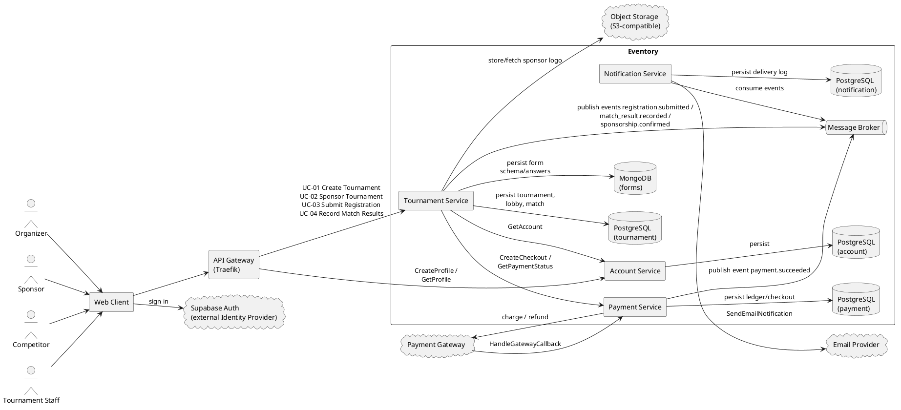

# Architecture Diagram

Matching ops table: [service-operations-collaborators.md](./service-operations-collaborators.md).

### Arrows

- Solid arrow: A calls B (or writes/reads a store). We do not draw responses.
- `publish …` / `consume events` on Message Broker: async domain events.
