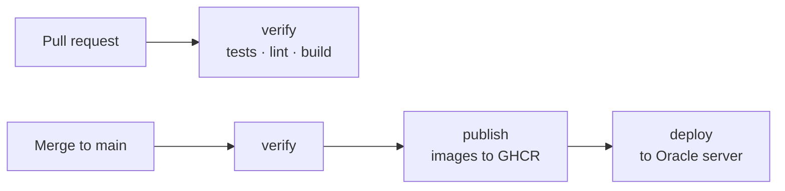

# Deployment

How code gets from a pull request to the live server. Handled automatically by GitHub.

---

## What happens when

| You do | GitHub does |
| --- | --- |
| Open a pull request | Runs tests, style checks, and a build. Nothing is deployed. |
| Merge into `main` | Builds images, publishes them, deploys to the server. |

If `verify` fails, nothing is published or deployed.

---

## Local vs production

| | Local | Production |
| --- | --- | --- |
| Compose file | `docker-compose.yml` | `docker-compose.production.yml` |
| Database | PostgreSQL in Docker on your machine | Supabase-hosted PostgreSQL |
| Images | Built on your machine | Pulled from GHCR, tagged by commit |
| Server | your laptop | Oracle cloud server |

Production never starts the local PostgreSQL container.

---

## Required GitHub secrets

Set once, in the repository settings. Without these, deployment fails.

| Secret | For |
| --- | --- |
| `PROD_SUPABASE_URL` | Login checks |
| `PROD_SUPABASE_PUBLISHABLE_KEY` | Login checks, browser side |
| `PROD_API_URL` | Public address of the backend |
| `PROD_DB_DSN` | Production database address |
| `ORACLE_HOST` | Server address |
| `ORACLE_USER` | Server login name |
| `ORACLE_SSH_KEY` | Server login key |
| `ORACLE_KNOWN_HOSTS` | Proves we are connecting to the right server |

`GITHUB_TOKEN` is provided automatically. You do not create it.

---

## Database jobs on the server

A separate workflow, `db-management.yml`, runs migrations and seeds against the production server. It is triggered manually, never on merge.

> ⚠️ Never run `make reset` against production. It deletes every row.
