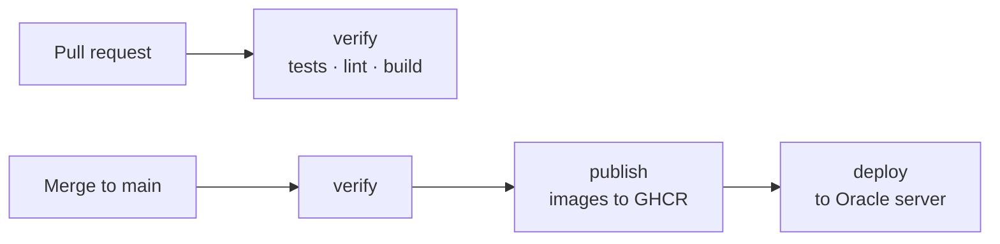

# Deployment

How code gets from a pull request to the live server. Handled automatically by GitHub.

---

## What happens when

| You do | GitHub does |
| --- | --- |
| Open a pull request | Runs tests, style checks, and a build. Nothing is deployed. |
| Merge into `main` | Builds images, publishes them, deploys to the server. |

```mermaid
flowchart LR
    PR["Pull request"] --> V["verify<br/>tests · lint · build"]
    M["Merge to main"] --> V2["verify"] --> P["publish<br/>images to GHCR"] --> D["deploy<br/>to Oracle server"]
```

If `verify` fails, nothing is published or deployed.

---

## Local vs production

| | Local | Production |
| --- | --- | --- |
| Compose file | `docker-compose.yml` | `docker-compose.production.yml` |
| Database | Postgres container with `account_db` and `tournament_db` | Postgres 18 container on the server, same two databases |
| Images | Built on your machine | Pulled from GHCR, tagged by commit |
| Public site | Traefik on port 8080, website on port 3000 | Traefik on ports 80 and 443, with a Let's Encrypt certificate |
| Server | your machine | Oracle cloud server |

Account and Tournament are separate images built from `backend/Dockerfile` with `SERVICE=account` or `SERVICE=tournament`. Each image contains `./api`, `./migrate`, and `./seed`. The API does not change the schema.

Production Postgres is `postgres:18` in `docker-compose.production.yml`. The first start of an empty volume runs `docker/postgres/init-databases.sh` and creates `account_db` and `tournament_db`. Account and Tournament reach it at `postgres:5432` on the Compose network. Port 5432 is not published. Supabase is still only for login. The database password is `PROD_POSTGRES_PASSWORD`. Use letters and numbers so it can sit in the connection string.

Deploy waits until Postgres is healthy, runs `./migrate` for Account, then Tournament, then starts the APIs.

Traefik is the public edge for `eventory.ddns.net`. It listens on ports 80 and 443, redirects HTTP to HTTPS, and gets the certificate from Let's Encrypt (TLS challenge). The contact email is GitHub secret `PROD_ACME_EMAIL`, written to the server as `ACME_EMAIL`. Certificates are stored in the `traefik_letsencrypt` volume.

`PROD_API_URL` must be `https://eventory.ddns.net`. That hostname is in the route labels. `/` goes to the frontend. `/api/v1/accounts` and `/health` go to Account. `/api/v1/tournaments` and `/api/v1/lobbies` go to Tournament. The frontend container calls Traefik on the Compose network over HTTP (`http://traefik`). `/standup` redirects to `/standup/`, which `docker/traefik/dynamic.yml` forwards to the host process on port 4174. That app stays outside Compose.

---

## Required GitHub secrets

Set once, in the repository settings. Without these, deployment fails.

| Secret | For |
| --- | --- |
| `PROD_SUPABASE_URL` | Login checks |
| `PROD_SUPABASE_PUBLISHABLE_KEY` | Login checks, browser side |
| `PROD_API_URL` | Public origin `https://eventory.ddns.net`, also written as the CORS origin |
| `PROD_ACME_EMAIL` | Contact email for the Let's Encrypt account |
| `PROD_POSTGRES_PASSWORD` | Password for the Postgres container. User is `admin` |
| `ORACLE_HOST` | Server address |
| `ORACLE_USER` | Server login name |
| `ORACLE_SSH_KEY` | Server login key |
| `ORACLE_KNOWN_HOSTS` | Proves we are connecting to the right server |

`GITHUB_TOKEN` is provided automatically. You do not create it.

---

## Database jobs on the server

`db-management.yml` is triggered manually, never on merge.

| Input | What it runs |
| --- | --- |
| Reset off | `./migrate` for Account, then Tournament |
| Reset on | Stop the APIs, `./migrate -reset` for Account, then `./migrate -reset` for Tournament |
| Seed on | `./seed` for Account, then Tournament |

Reset drops the `public` schema in that service's database only. Account and Tournament each have their own database, so both resets are required. Deleting the `eventory-production_postgres_data` volume removes the data files. The next deploy creates empty databases again.
