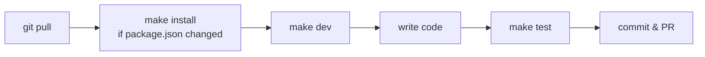

# Getting Started

How to set up Eventory and run it on your machine.

---

## 1. Install these first

| Tool | Version | Why |
| --- | --- | --- |
| **Docker Desktop** | any recent | Runs the database |
| **Go** | 1.26+ | Runs the backend |
| **Node.js** | 24+ | Runs the frontend |
| **GNU Make** | optional | Typing shortcuts. Every shortcut has a plain equivalent below. |

Check what you have:

```bash
docker --version && go version && node --version
```

---

## 2. Create your settings files

Two files hold local settings (database password, Supabase keys). They are **not** in git, so you make them yourself, once.

```bash
cp backend/.env.example  backend/.env
cp frontend/.env.example frontend/.env.local
```

The defaults work for local development. You only need real Supabase keys to test the actual Google login. \
DONT forget to obtain it from ALL IN ONE drive / discord chat

---

## 3. Install packages

```bash
make install
```

Plain equivalent:

```bash
npm --prefix frontend ci
go -C backend mod download
go install github.com/air-verse/air@v1.67.3
```

> ⚠️ **Re-run this whenever a teammate adds a package.** Skipping it causes a `Module not found` error. See [Troubleshooting](troubleshooting.md).

---

## 4. Prepare the database

```bash
make db      # start the database container first
make reset   # create the tables (wipes existing data)
make seed    # add sample tournaments and accounts
```

Plain equivalent:

```bash
docker compose --env-file backend/.env --env-file frontend/.env.local up -d --wait postgres
go -C backend run ./cmd/migrate -reset
go -C backend run ./cmd/seed
```

> The run commands in step 5 create tables but **never add sample data**. Without `seed`, your tournament list will be empty.

---

## 5. Pick a way to run it

| | **Way 1: All Docker** | **Way 2: Hybrid** ⭐ | **Way 3: Manual** |
| --- | --- | --- | --- |
| **Command** | `make dev-docker` | `make dev` | see below |
| **Terminals** | 1 | 1 | 2 |
| **Runs in Docker** | everything | database only | database only |
| **First start** | ~9 min | ~30 sec | ~30 sec |
| **Later starts** | ~1 min | ~15 sec | ~15 sec |
| **Reload on save** | slower | fast | fast |
| **Best for** | "just make it work" | daily work | seeing each error clearly |

**Way 2 is the team default.** Use Way 1 if your machine gives you tool version problems. Use Way 3 when you want to watch backend and frontend logs separately.

---

### Way 1: All Docker

```bash
make dev-docker
```

Plain equivalent:

```bash
docker compose --env-file backend/.env --env-file frontend/.env.local up --build
```

Stop it with `Ctrl+C`, then `make down`.

---

### Way 2: Hybrid ⭐ recommended

```bash
make dev
```

This one command starts the database in Docker, creates any missing tables, then starts the backend and frontend on your machine. Works on Windows, macOS and Linux.

No `make`? Run the script directly:

```bash
# Windows
powershell -ExecutionPolicy Bypass -File ./scripts/dev.ps1

# macOS / Linux
bash ./scripts/dev.sh
```

Stop it with `Ctrl+C`.

---

### Way 3: Manual, two terminals

**Terminal 1, backend:**

```bash
cd backend
docker compose -f ../docker-compose.yml --env-file .env up -d --wait postgres
air -c .air.toml
```

**Terminal 2, frontend:**

```bash
cd frontend
npm run dev
```

---

## 6. Open it

| URL | What |
| --- | --- |
| http://localhost:3000 | The website |
| http://localhost:8080/docs | Clickable list of backend endpoints |
| http://localhost:8080/health | Should answer with an empty "204" response |

> No Supabase keys? Use the **Dev Quick Login** button in the navbar to fake a login and try all three modes.

---

## Daily routine



**Changed a backend endpoint?** Start the backend, then run `npm --prefix frontend run openapi:generate`. This copies the backend's endpoint list into the frontend so TypeScript can catch mistakes.

---

## Command cheat sheet

### Running

| Shortcut | Plain command | Does |
| --- | --- | --- |
| `make dev` | `bash ./scripts/dev.sh` (or `dev.ps1`) | Way 2, everything at once |
| `make dev-docker` | `docker compose ... up --build` | Way 1, all in Docker |
| `make db` | `docker compose ... up -d --wait postgres` | Database only |
| `make down` | `docker compose ... down` | Stop all containers |
| `make backend` | `cd backend && air -c .air.toml` | Backend only |
| `make frontend` | `npm --prefix frontend run dev` | Frontend only |

### Database

| Shortcut | Plain command | Does |
| --- | --- | --- |
| `make migrate` | `go -C backend run ./cmd/migrate` | Add new tables, keep data |
| `make reset` | `go -C backend run ./cmd/migrate -reset` | ⚠️ Delete everything, rebuild tables |
| `make seed` | `go -C backend run ./cmd/seed` | Add sample data |

### Checks before a pull request

| Shortcut | Plain command | Does |
| --- | --- | --- |
| `make test` | all three below | Everything at once |
| | `go -C backend test ./...` | Backend tests |
| | `npm --prefix frontend run lint` | Frontend code style |
| | `npm --prefix frontend run typecheck` | Frontend type errors |

---

Something not working? → **[Troubleshooting](troubleshooting.md)** \
Word you don't know? → **[Glossary](glossary.md)**
