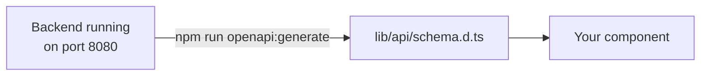

# Frontend

The part of Eventory people see and click. Built with Next.js 16 and React 19.

Setup and run instructions live in **[Getting Started](../docs/getting-started.md)**. This page is about the code.

---

## Run it

```bash
npm install    # first time, and after a teammate adds a package
npm run dev    # http://localhost:3000
```

You do **not** need the backend or Supabase keys to build UI. Click **Dev Quick Login** in the navbar to fake a login, then switch modes from the avatar menu.

---

## Where things go

| Folder | Holds | Rule |
| --- | --- | --- |
| `app/` | URLs, layouts, page shells | Folder name = URL. Keep it thin. |
| `features/` | Code for one topic (tournaments, lobbies, auth) | Most of your work happens here |
| `components/ui/` | Buttons, inputs, dialogs | Shared, not tied to any topic |
| `components/` | Navbar and other shared layout pieces | Shared across features |
| `context/` | Who is logged in, which mode is active | Global state |
| `lib/` | Backend client, helpers, generated types | Plumbing |
| `proxy.ts` | Blocks pages you are not allowed to see | Login guard |

**The split that matters:** `app/` decides *which* page shows. `features/` decides *what is on it*.

---

## URLs and folder names

Next.js turns folders into URLs:

| Folder | URL |
| --- | --- |
| `app/(public)/tournaments/page.tsx` | `/tournaments` |
| `app/(public)/tournaments/[tournamentId]/page.tsx` | `/tournaments/123` |
| `app/(public)/lobbies/[inviteCode]/page.tsx` | `/lobbies/ABC123` |
| `app/(organizer)/organizer/page.tsx` | `/organizer` |

Two naming tricks:

| Written as | Means |
| --- | --- |
| `(public)` | Grouping only. **Not** part of the URL. Lets each group have its own navbar. |
| `[tournamentId]` | A blank to fill in. `/tournaments/abc` gives you `tournamentId = "abc"`. |

The four groups are `(auth)` for login, `(public)` for competitors, `(organizer)`, and `(sponsor)`.

---

## Talking to the backend

The backend publishes a machine-readable list of everything it can do. We copy that list into TypeScript so mistakes get caught while you type, not in the browser.



**After any backend endpoint changes,** start the backend, then:

```bash
npm run openapi:generate
```

Using it in a component:

```tsx
import { $api } from "@/lib/api/client";

const { data, isLoading } = $api.useQuery("get", "/api/v1/tournaments");
```

---

## Commands

| Command | Does |
| --- | --- |
| `npm run dev` | Start the site, reloads as you save |
| `npm run lint` | Check code style |
| `npm run typecheck` | Check for type mistakes |
| `npm run format` | Auto-format the code |
| `npm run openapi:generate` | Re-copy the backend's endpoint list |

Run `lint` and `typecheck` before opening a pull request.

---

## Adding a UI component

```bash
npx shadcn@latest add dialog     # install it
npx shadcn@latest docs dialog    # see how to use it
```

Before writing UI code, read [`AGENTS.md`](AGENTS.md) and the rules in `.agents/skills/`. They cover how our button, form and loading components are meant to be composed.

---

Something broken? → **[Troubleshooting](../docs/troubleshooting.md)**
